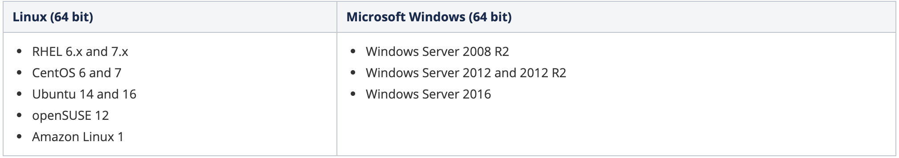

# AppDynamics Platform Installation (LINUX)

## Description

This lab guides you through the process of installing and configuring the AppDynamics platform components for an on-premise deployment.  The architecture diagram below shows these components with their communication paths and payloads.  

In this Lab for simplicity we will install all AppDynamics Components (Enterprise Console, Controller, Events Service, End User Monitoring Server) on a Standalone Virtual Machine.

In this Lab, you will learn to:
1. Install the Enterprise Console (aka Platform Admin) tool
2. Install and configure the AppDynamics Controller software
3. Install and configure the Events Service
4. Install and configure the End User Monitoring (EUM) Server

The software versions used in the lab are the most recent generally available at the time the lab was created.  As subsequent versions continue to be released, expect slight variations to command line output and screen shot graphics.  Though normally inconsequential, it is recommended to note these differences for reference in troubleshooting should they become significant.

## Setup

### Step 1: Prepare Virtual Machine Specs.

- **Operating System:** Linux or Windows  (This Guide  is based on Linux OS)
- **Linux Distribution:** Any from the below list (This Guide is based on CentOS7)

- **CPU:** 4 Cores (Minimum)
- **Memory:** 32 GB RAM (Minimum)
- **Storage:** 60 GB (Mimimum)

### Step 2: Enterprise Console Requirements

The Enterprise Console can run on the same host as the Controller and the embedded Events Service. If this is the case, the machine you choose to run the Enterprise Console must meet the requirements for all the components that run on that machine.

Reference documentation can be found on the AppDynamics documents site - [Enterprise Console Requirements](https://docs.appdynamics.com/display/PRO45/Enterprise+Console+Requirements, "Enterprise Console Requirements").

1. We will need to install these required libraries
	<pre><code>
 	yum install libaio
	yum install numactl
	yum install tzdata
	yum install ncurses-libs
 	</code></pre>
	Note: the above required libraries are based on Red Hat and CentOS, for other Distros, please refer to [Enterprise Console Requirements](https://docs.appdynamics.com/display/PRO45/Enterprise+Console+Requirements, "Enterprise Console Requirements").

2.  AppDynamics requires the following hard and soft per-user limits in Linux: 
    * Open file descriptor limit (nofile): 65535
    * Process limit (nproc): 8192  
    
    Following the steps in [Configure User Limits in Linux Controllers](https://docs.appdynamics.com/display/PRO45/Prepare+Linux+for+the+Controller#PrepareLinuxfortheController-configure_in_linuxConfigureUserLimitsinLinux):
  	<pre><code>
	vi /etc/security/limits.d  	
 	</code></pre>
	And add the following at the end of the file:
	<pre><code>
	* hard nofile 65535
	* soft nofile 65535
	* hard nproc 8192
	* soft nproc 8192 	
 	</code></pre>
	Then logout from the terminal and login again.

### Step 3: Install Enterprise Console (aka Platform Admin)

In this exercise, you will be setting up the Enterprise Console.  This utility provides a browser-based user interface that allows an AppDynamics administrator to install and manage the Controller and Events Service components of the AppDynamics platform.  A CLI for the Enterprise Console is available, but is outside the scope of this lab.

Reference documentation can be found on the AppDynamics documents site - [Enterprise Console Documentation](https://docs.appdynamics.com/display/PRO45/Enterprise+Console, "Enterprise Console Documentation").

1. Download and copy the Platform Admin Installer Script to the lab host.
   Log into www.download.appdynamics.com to download the "Enterprise Console - 64-bit Linux(sh)"

2. Copy the .sh file to your Host either using SCP on if your Desktop is MAC/Linux or using WINSCP if your Desktop is Windows

3. On the Host, Make the installer script executable:
	<pre><code>
 	chmod a+x platform-setup-x64-linux-20.x.x.x.sh
 	</code></pre>

4. Install the Platform Admin software:
	<pre><code>
	sudo su
 	./platform-setup-x64-linux-20.x.x.x.sh
 	</code></pre>
    with inputing the below
    	<pre><code>
	I accept the agreement: 1
	Where should AppDynamics Enterprise Console be installed?: /opt/appdynamics/platform
	Database Root User Password: AppD123
	Database Port: 3377 (default)
	Enterprise Console Database Password: AppD123
	Enable Https Connection: n
	Enterprise Console Host Name: In case of AWS, Enter the public DNS name of the lab EC2 instance
	Enterprise Console Port: 9191 (default)
	Enterprise Console Root User Name: admin (default)
	Enterprise Console Root User Password: AppD123
 	</code></pre>
    After a few minutes, you should see output similar to that shown below...
    	<pre><code>
    	Setup has finished installing AppDynamics Enterprise Console on your computer.
	To install and manage your AppDynamics Platform, use the Enterprise Console
	CLI from /opt/appdynamics/platform/platform-admin/bin directory.
	Finishing installation ...
    	</code></pre>

5. To confirm the Enterprise Console is functioning properly, verify you can connect to its URL in a web browser and authenticate using the information specified in the installation (Username: admin, Password: AppD123)
 	<pre><code>
	http://[your-ip-address]:[EnterpriseConsolePort]
	</code></pre>
	

### Step 4: Install AppDynamics Controller & Events Service

In the Enterprise Console browser interface.  You will use the Enterprise console to install the Controller and Events Service components of the AppDynamics platform.  
The Controller provides the main AppDynamics GUI which is backed by a MySQL database, while the Events Service is the facility that stores unstructured data generated by various AppDynamics functions.

Installation of both components can be accomplished using the CLI, but that procedure is beyond the scope of this lab.  
Also note that the lab focuses on installation and configuration procedures in a learning environment, but you should be aware that additional steps may be necessary to address security, performance, availability, and scalability considerations in a production deployment.  

Reference documentation can be found on the AppDynamics web site - [Controller Documentation](https://docs.appdynamics.com/display/PRO45/Controller+Deployment) and [Events Service Documentation](https://docs.appdynamics.com/display/PRO45/Events+Service+Deployment).

1. From the Enterprise Console UI, select the Install tab and click the Express Install type.

2. In the **Name the Platform** section, Provide a name of your choice for the platform and confirm the default **Installation Path** value is a subdirectory of the installation directory we specified earlier.

3. In the **Add a Host** section, choose Use **Enterprise Console Host**.

4. In the **Install the Controller** section:
	- Select the **Demo profile**
	- Set the Controller Admin Username to **admin**
	- Set the Controller **Admin Password** to **welcome1**
	- Set the Controller Controller Root User Password to **welcome1**
	- Set Database Root Password to **welcome1**
	

5. Click the **Submit** button, The installation will begin immediately but it may take a few minutes before the jobs appear and begin reporting their progress on the page.

6. After the jobs have completed successfully (up to 15 minutes), click the Controller and Events Service sections to make sure each shows a health state of Normal.

7. To confirm the Controller is running properly, verify you can connect to its URL in a web browser and authenticate using the information specified in **Step 4** (Username: admin, Password: welcome1)
	<pre><code>
 	http://[your-ip-address]:8090
 	</code></pre>
		
	
8. Ping the Events Service API port in a browser.  A successful “pong” response confirms the service is running properly.
	<pre><code>
 	http://[your-ip-address]:9080/_ping
 	</code></pre>
	
 
9. Deploy the provided license by coping your license file (.lic) to the controller directory at **/opt/appd/platform/product/controller/**

10. In the Controller UI, confirm the new license has been applied by navigating to the Settings icon (⚙) in the upper right corner of the page and selecting License.  Make sure the the license details now show it as a Pro Trial edition and includes entitlements for different agents.
Note: If the licenses are not reflected as below in 10 minutes, perform a Controller Restart (Without database restart) from the Platform Admin.

### Step 4: Install End User Monitoring Server

In this exercise, you will be setting up the End User Monitoring (EUM) Server.  This component acts as the on-premise processor for data sent from the browser and mobile EUM agents.  
The EUM Server is not currently integrated with the Enterprise Console so the installation portion will be done from the lab host CLI.  

Reference documentation can be found on the AppDynamics documents site - [EUM Server Documentation](https://docs.appdynamics.com/display/PRO45/EUM+Server+Deployment).

1. Open a New Private Window (New Incognito Window in Chrome) to avoid using cached controller credentials from previous browser sessions.

2. Access the Controller [Administration Console](https://docs.appdynamics.com/display/PRO45/Access+the+Administration+Console) by connecting to its URL and authenticating with credentials you specified in Controller Installation wizard (Username: admin, Password: welcome1). This is a separate interface from the primary Controller UI.
	<pre><code>
 	http://[your-ip-address]:8090/controller/admin.jsp
 	</code></pre>
	

2. Navigate to the Controller Setting section, and search for **appdynamics.es.eum.key** parameter
	- Note the **Events Service Key** for later use in Step 10.
	
 
3. Connect the EUM Server with the AppDynamics Controller by updating the following parameter values in the Administration Console, clicking the **Save button after each change**
	- eum.beacon.host = [your-ip-address]:7001
	- eum.beacon.https.host = https://[your-ip-address]:7002
	- eum.cloud.host = http://localhost:7001
	- eum.es.host = [your-ip-address]:9080
	- eum.mobile.screenshot.host = [your-ip-address]:7001

4. Download the EUM Server Installer Script to the lab host.
   Log into www.download.appdynamics.com to download the "EUM Server - 64-bit linux (sh)"

   

5. Copy the .sh file to your Host either using SCP on if your Desktop is MAC/Linux or using WINSCP if your Desktop is Windows

6. On the Host, Make the installer script executable:
	<pre><code>
 	chmod a+x euem-64bit-linux-20.x.x.x.sh
 	</code></pre>

7. Install the Platform Admin software:
	<pre><code>
	sudo su
 	./euem-64bit-linux-20.x.x.x.sh
 	</code></pre>
    with inputing the below
    	<pre><code>
	I accept the agreement: 1
	Where should AppDynamics End User Monitoring be installed?: /opt/appdynamics/eum
	Select Installation Type: 1 (Demo)
	Database Port: 3388 (default)
	Root User Password: welcome1 (the same as specified during the Controller Database Setup)
	eum_user Password: AppD123
	HTTP Port: 7001 (default)
	HTTPS Port: 7002 (default)
	Key Store Password: AppD123
 	</code></pre>
    After a few minutes, you should see output similar to that shown below...
    	<pre><code>
    	Setup has finished installing AppDynamics End User Monitoring on your computer.
	To finish setting up AppDynamics End User Monitoring Server, you must complete these post installation tasks:
   	 Provision the EUM license.
   	 Configure the Events Service properties and other properties in the file EUM_HOME/bin/eum.properties, then restart AppDynamics End User Monitoring Server
   	 Connect the AppDynamics End User Monitoring Server with AppDynamics Controller through the Controller Administration Console.
   	 For more information, see EUM Server Deployment.
	 Finishing installation ...
    	</code></pre>
	
8. Verify the EUM Server is running by pinging the EUM Server port in a browser.  A successful “ping” response confirms it is responding properly.
	<pre><code>
 	http://[your-ip-address]:7001/eumaggregator/ping
 	</code></pre>
	
 
9. From the EUM processor directory on on the lab host (you must be in eum-processor directory for the command to run properly), provision the EUM portion of the license file:
	<pre><code>
 	cd /opt/appdynamics/eum/eum-processor
	./bin/provision-license /opt/appdynamics/platform/product/controller/license.lic
 	</code></pre>
	You should see output similar to that shown below…
	<pre><code>
	Reading the license file at /opt/appdynamics/platform/product/controller/license.lic
	Successfully read the license file
	Provisioning from license file /opt/appdynamics/platform/product/controller/license.lic
	Register the account ...
	AccountRegistrationResult:
	isValid:true, isAlreadyRegistered:false, description:Successfully completed account registration, Account{accountName='test-eum-account-sherifmedhat-1601814891057', globalAccountName='bogus global account name', key='[FILTERED]', timestamp=1601826813030, lastAggregatedMin=1601826780000, accountStatus='Y', activityStatus='Y', lastActivityTimestamp=1601826813030, activityVersion='0', controllerEumApiVersion='0', controllerVersion='unknown', crMapFilesGeneration='-1', analyticAccountCreated='N', licenseTermsUpdateSourcePrecedence='0', deleted=false, deletedTime='1970-01-01T00:00:00.000Z}

	EUM Account [test-eum-account-sherifmedhat-1601814891057] with key [f3b8b684-913f-4642-a5e3-709468c566dc] is registered and license terms are provisioned in the EUM PROCESSOR
	</code></pre>
	The Warning message above can be ignored…

10. Using a text editor of your choice, configure the Events Service properties by updating the following parameter values in the eum.properties file in /opt/appdynamics/eum/eum-processor/bin/:
	<pre><code>	
	cd /opt/appdynamics/eum/eum-processor/bin/
 	vi eum.properties
 	</code></pre>
	and change the below:
	<pre><code>
	analytics.enabled=true
	analytics.serverHost=[your-ip-address]
	analytics.accountAccessKey=[eum_key] (the one collected in step 2)
	</code></pre>

11. Remaining in the EUM processor directory on on the lab host (you must be in this directory for the command to run properly), restart the EUM Server by stopping the service, confirming the process is no longer running, and starting it:
	<pre><code>
	cd /opt/appdynamics/eum/eum-processor/
	bin/eum.sh stop
	ps -ef | grep -i eum | grep -v grep (no process should be listed)
	bin/eum.sh start
	ps -ef | grep -i eum | grep -v grep (one process should be listed)
	</code></pre>

12. In the Controller UI, confirm the EUM license has been applied by navigating to the Settings icon (⚙) in the upper right corner of the page and selecting License.  In the User Experience section of the page, the Account Name and License Key should be visible.  Additionally, the Edition should show EUM Pro or Mobile Pro for Browser Real User Monitoring and Mobile Real User Monitoring, respectively.

-----

## Notes

1. In case of a Server restart, you can start back all the serivces via the CLI:
	<pre><code>
	cd /opt/appdynamics/platform/platform-admin
	bin/platform-admin.sh start-platform-admin
	bin/platform-admin.sh start-controller-db
	bin/platform-admin.sh start-controller-appserver
	bin/platform-admin.sh submit-job --platform-name AppDPlatform --service events-service --job start
	</code></pre>

## Next Steps

Upon succesful completion of the above, please refer back to your AppDynamics Channel SE to guide you on the below:
1. Create a Sample Application Environment
2. Exercise to Moniitor the Sample Application by Installing AppDynamics Agents

