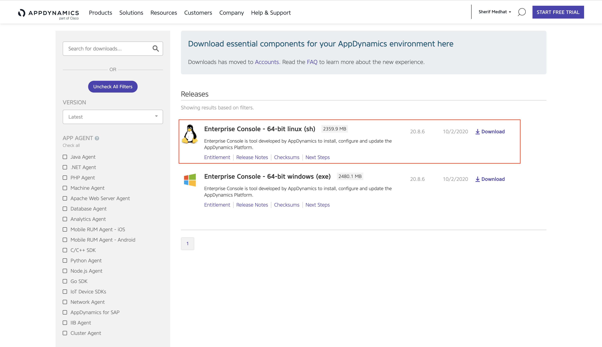

# AppDynamics Platform Installation (LINUX)

## Description

This lab guides you through the process of installing and configuring the AppDynamics platform components for an on-premise deployment.  The architecture diagram below shows these components with their communication paths and payloads.  In this lab, you will learn to:
1.Install the Enterprise Console (aka Platform Admin) tool
2.Install and configure the AppDynamics Controller software
3.Install and configure the Events Service
4.Install and configure the End User Monitoring (EUM) Server

The software versions used in the lab are the most recent generally available at the time the lab was created.  As subsequent versions continue to be released, expect slight variations to command line output and screen shot graphics.  Though normally inconsequential, it is recommended to note these differences for reference in troubleshooting should they become significant.

## Setup

# Exercise 1: Enterprise Console (aka Platform Admin)

In this exercise, you will be setting up the Enterprise Console.  This utility provides a browser-based user interface that allows an AppDynamics administrator to install and manage the Controller and Events Service components of the AppDynamics platform.  A CLI for the Enterprise Console is available, but is outside the scope of this lab.  Reference documentation can be found on the AppDynamics documents site - [Enterprise Console Documentation](https://docs.appdynamics.com/display/PRO45/Enterprise+Console "Enterprise Console Documentation").

1. Download the Platform Admin software to the lab host.  The command below assumes you have created an account on www.appdynamics.com and can log into that site with permissions to download software

2. Copy the .sh file to your Host either using SCP on if your Desktop is MAC/Linux or using WINSCP if your Desktop is Windows

3. Make the installer script executable:
	<pre><code>
 	chmod a+x platform-setup-x64-linux-20.x.x.x.sh
 	</code></pre>

4. Install the Platform Admin software:
	<pre><code>
	mkdir /opt/appdynamics/platform
	chmod
 	./platform-setup-x64-linux-20.x.x.x.sh
 	</code></pre>
    with inputing the below
    	<pre><code>
	I accept the agreement: 1
	Where should AppDynamics Enterprise Console be installed?: /opt/appdynamics/platform
	Database Root User Password: AppD123
	Database Port: 3377 (default)
	Enterprise Console Database Password: AppD123
	Enable Https Connection: n
	Enterprise Console Host Name: In case of AWS, Enter the public DNS name of the lab EC2 instance
	Enterprise Console Port: 9191 (default)
	Enterprise Console Root User Name: admin (default)
	Enterprise Console Root User Password: AppD123
 	</code></pre>
    After a few minutes, you should see output similar to that shown below...
    	<pre><code>
    	Setup has finished installing AppDynamics Enterprise Console on your computer.  
	To install and manage your AppDynamics Platform, use the Enterprise Console CLI from /opt/appd/platform/platform-admin/bin directory.
	Finishing installation …
    	</code></pre>

5. To confirm the Enterprise Console is functioning properly, verify you can connect to its URL in a web browser and authenticate using the information specified in steps 1.3.g - 1.3.i
http://[your-ip-address]:[Enterprise Console Port]

# Exercise 1: AppDynamics Controller & Events Service

This exercise begins where the last one ended - in the Enterprise Console browser interface.  You will use the Enterprise console to install the Controller and Events Service components of the AppDynamics platform.  The Controller provides the main AppDynamics GUI which is backed by a MySQL database, while the Events Service is the facility that stores unstructured data generated by various AppDynamics functions.

Installation of both components can be accomplished using the CLI, but that procedure is beyond the scope of this lab.  Also note that the lab focuses on installation and configuration procedures in a learning environment, but you should be aware that additional steps may be necessary to address security, performance, availability, and scalability considerations in a production deployment.  Reference documentation can be found on the AppDynamics web site - Controller Documentation and Events Service Documentation.

